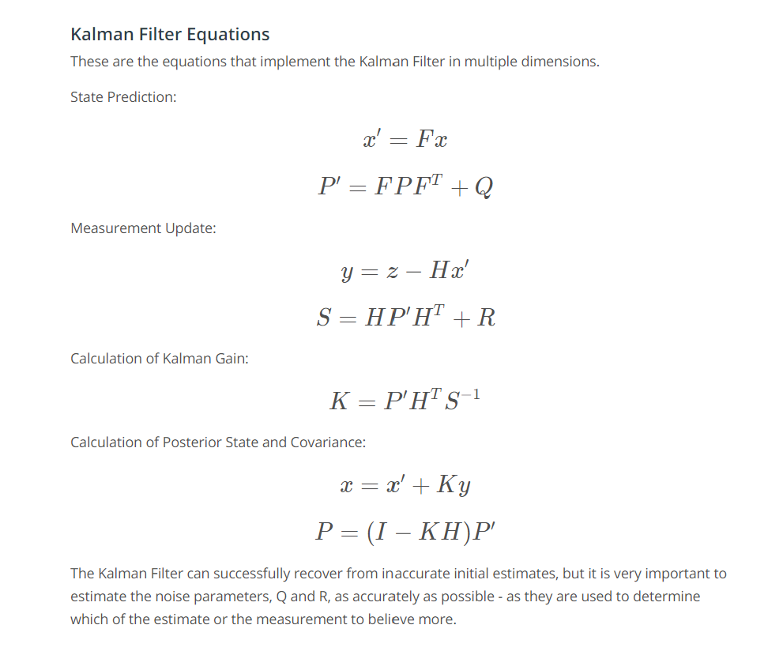

# Kalman-Filter-Lab
KF - linear

EKF - nonlinear

UKF - highly nonlinear

μ: Mean of the prior belief 

σ^2: Variance of the prior belief 

v: Mean of the measurement 

r^2: Variance of the measurement

τ: Mean of the posterior

s^2: Variance of the posterior

The new mean is a weighted sum of the prior belief and measurement means. With uncertainty, a larger number represents a more uncertain probability distribution.
**Measurement Update**:
μ' = (r^2 * μ + σ^2 * v)/(r^2 + σ^2)

σ^2' = 1/( (1/r^2)  + (1/σ^2)

The two Gaussians provide us with more information together than either Gaussian offered alone. As a result, our new state estimate is more confident than our prior belief and our measurement.

**State Prediction**
Posterior Mean: μ' = μ1 + μ2
Posterior Variance: σ^2' = (σ1)^2 + (σ2)^2

## Multivariate Kalman Filter
This [link](https://classroom.udacity.com/nanodegrees/nd209/parts/a431d446-05df-4641-9e3d-79e1d55a7a2f/modules/b66739be-878e-4cea-8569-881b7eb2d34c/lessons/f002d591-94af-4c70-aeac-ac2ed6f7b527/concepts/2e25ed5b-4001-41e8-8cbc-478662356527) to see the math

Check out this about Kalman Gain:

**Conclusion: Kalman Gain K is the factor that tuning how much trust can we give about the sensor measurement and model prediction in every step.**

    

